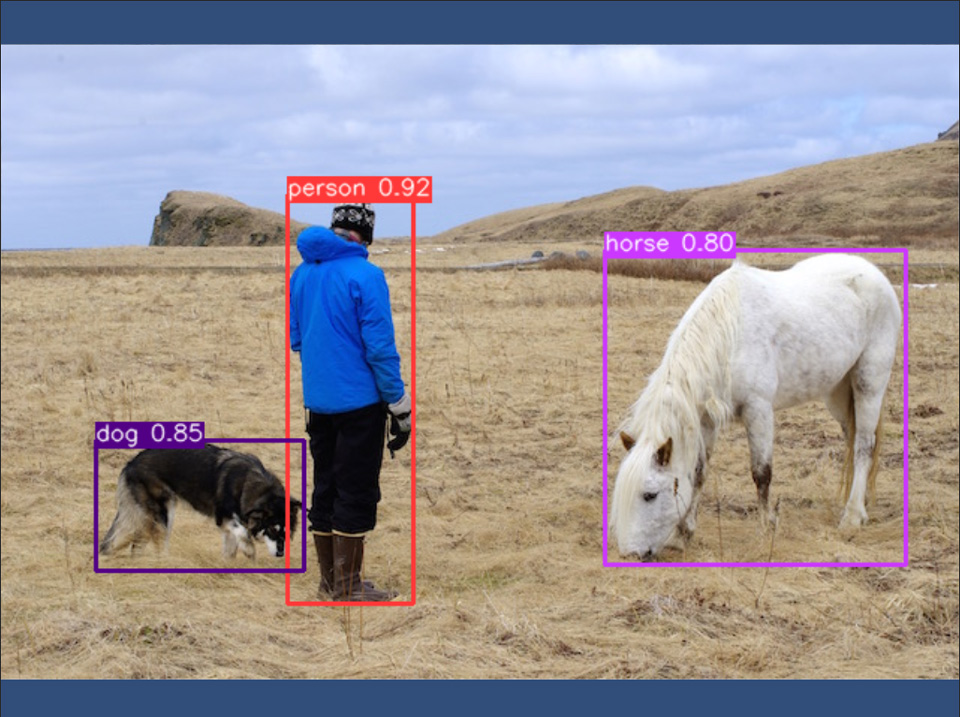
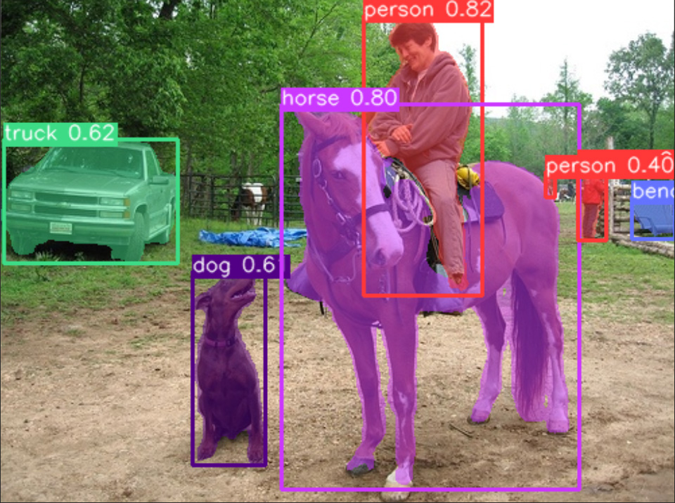
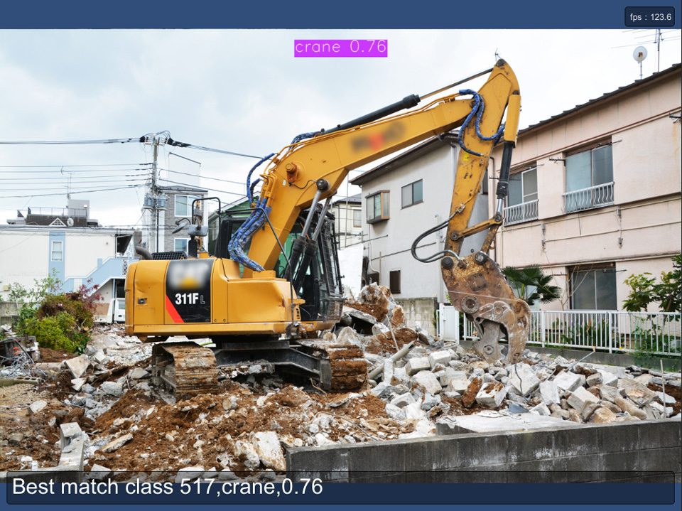

# YOLOv5 With OpenCVForUnity Example
- An example of using OpenCV dnn module with YOLOv5. [https://github.com/ultralytics/yolov5](https://github.com/ultralytics/yolov5)
- This example can also work for [YOLOv6](https://github.com/meituan/YOLOv6) models, which has the same input/output shapes as the YOLOv5 model.

## Environment
- Windows / Mac / Linux / WebGL / Android / iOS
- Unity >= 2020.3.48f1+
- Scripting backend MONO / IL2CPP
- [OpenCV for Unity](https://assetstore.unity.com/packages/tools/integration/opencv-for-unity-21088?aid=1011l4ehR) 2.5.8+

## Setup
1. Download the latest release unitypackage. [YOLOv5WithOpenCVForUnityExample.unitypackage](https://github.com/EnoxSoftware/YOLOv5WithOpenCVForUnityExample/releases)
1. Create a new project. (YOLOv5WithOpenCVForUnityExample)
1. Import OpenCVForUnity.
1. Import the YOLOv5WithOpenCVForUnityExample.unitypackage.
1. Add the "Assets/YOLOv5WithOpenCVForUnityExample/*.unity" files to the "Scenes In Build" list in the "Build Settings" window.
1. Build and Deploy.

## Export YOLOv5 model to ONNX
1. [YOLOv5_export_to_OpenCVDNN_ONNX.ipynb](https://github.com/EnoxSoftware/YOLOv5WithOpenCVForUnityExample/tree/master/models/YOLOv5/YOLOv5_export_to_OpenCVDNN_ONNX.ipynb)
1. [YOLOv5_segment_export_to_OpenCVDNN_ONNX.ipynb](https://github.com/EnoxSoftware/YOLOv5WithOpenCVForUnityExample/tree/master/models/YOLOv5_segment/YOLOv5_segment_export_to_OpenCVDNN_ONNX.ipynb)
1. [YOLOv5_classify_export_to_OpenCVDNN_ONNX.ipynb](https://github.com/EnoxSoftware/YOLOv5WithOpenCVForUnityExample/tree/master/models/YOLOv5_classify/YOLOv5_classify_export_to_OpenCVDNN_ONNX.ipynb)

## Works with Multi-Object Tracking (MOT)
1. [MultiObjectTrackingExample](https://github.com/EnoxSoftware/OpenCVForUnity/tree/master/Assets/OpenCVForUnity/Examples/Advanced/MultiObjectTrackingExample)

## ScreenShot
 
 
 

## Tutorials
1. [How to Train YOLO v5 on a Custom Dataset](https://www.youtube.com/watch?v=MdF6x6ZmLAY)

