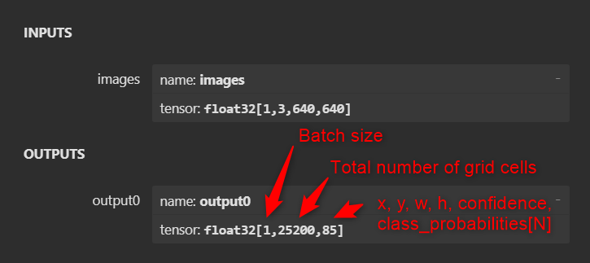
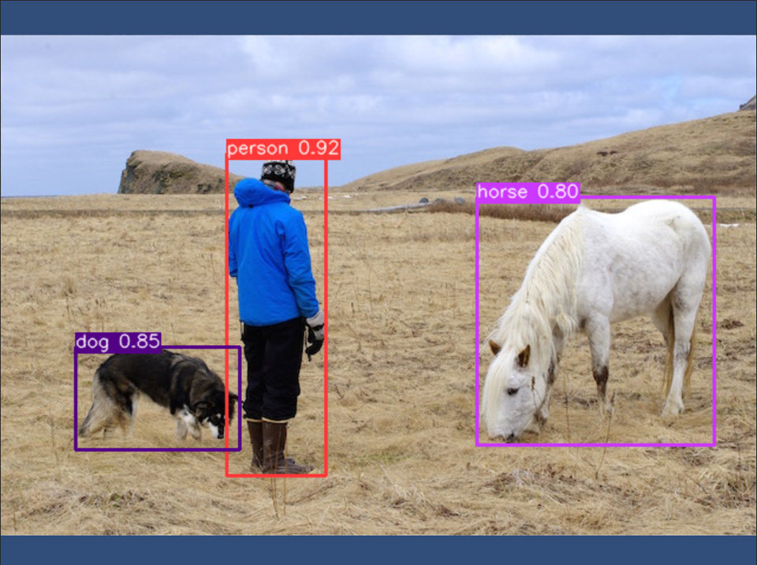
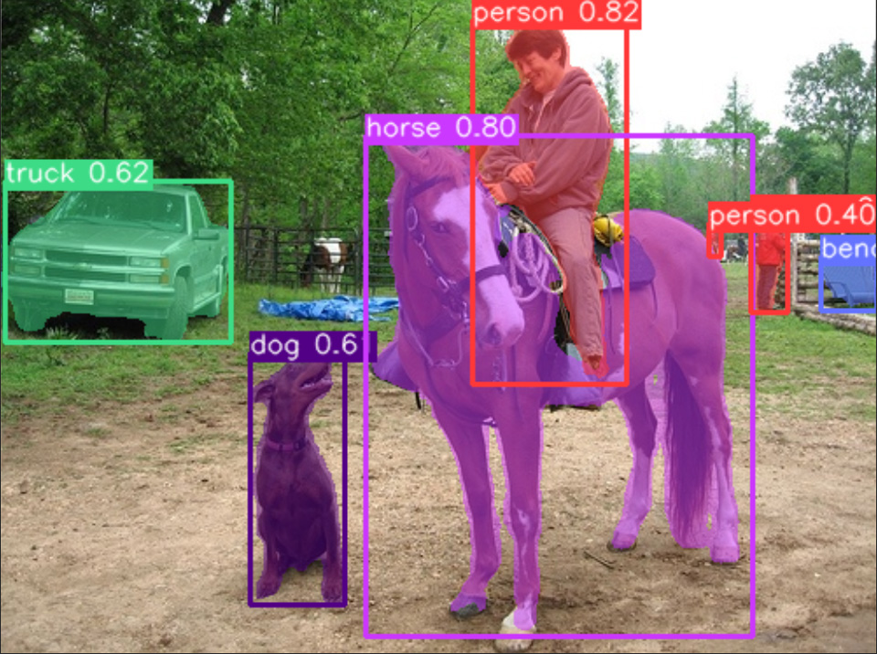
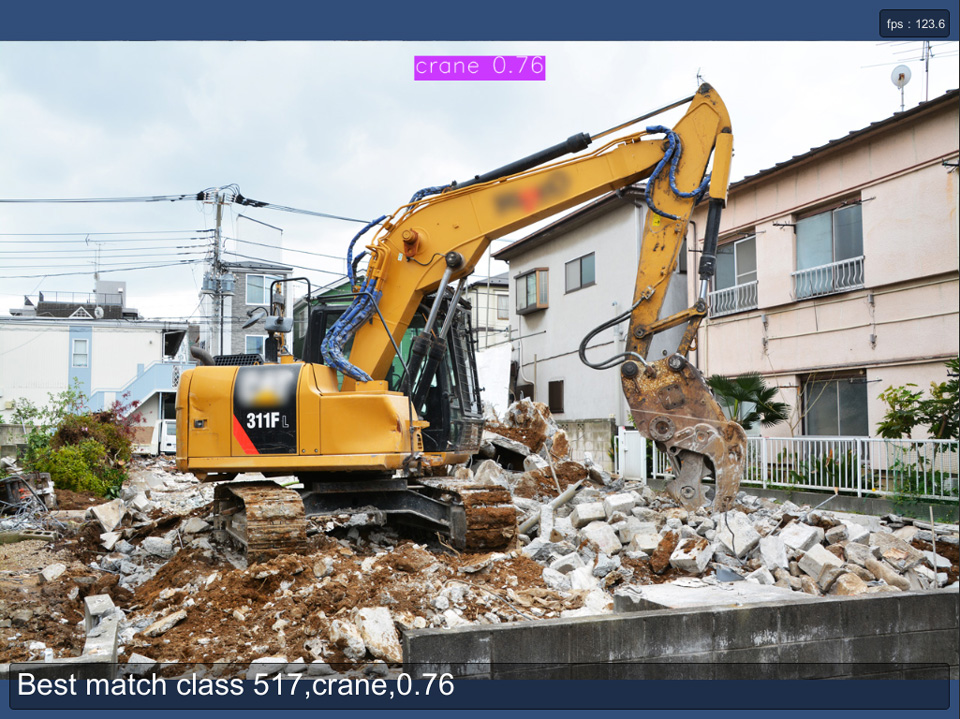

# YOLOv5 With OpenCVForUnity Example

> **Notice:** The YOLOv5 With OpenCVForUnity Example has been integrated into the **[OpenCV for Unity](https://assetstore.unity.com/packages/tools/integration/opencv-for-unity-21088?aid=1011l4ehR)** package.
>
> The example files are no longer distributed from this repository.
> The repository is now maintained as a distribution repository for **model files used by the examples**.
>
> The model files in this repository are **pretrained ONNX models distributed by [Ultralytics](https://github.com/ultralytics/ultralytics)**. These files are redistributed without modification under the applicable Ultralytics licenses. Please check the applicable license before using the models in your own applications.
>
> If you are looking for the YOLOv5 example itself, please use the examples included with OpenCVForUnity.

- An example of using OpenCV dnn module with YOLOv5. [https://github.com/ultralytics/yolov5](https://github.com/ultralytics/yolov5)
- This example can also work for [YOLOv6](https://github.com/meituan/YOLOv6), [YOLOv7](https://github.com/WongKinYiu/yolov7) models, which has the same input/output shapes as the YOLOv5 model.

 

## Training from custom data and export to ONNX
1. [YOLOv5_export_to_OpenCVDNN_ONNX](https://github.com/EnoxSoftware/YOLOv5WithOpenCVForUnityExample/tree/master/models/YOLOv5/)
1. [YOLOv5_segment_export_to_OpenCVDNN_ONNX](https://github.com/EnoxSoftware/YOLOv5WithOpenCVForUnityExample/tree/master/models/YOLOv5_segment/)
1. [YOLOv5_classify_export_to_OpenCVDNN_ONNX](https://github.com/EnoxSoftware/YOLOv5WithOpenCVForUnityExample/tree/master/models/YOLOv5_classify/)
1. [YOLOv6_export_to_OpenCVDNN_ONNX](https://github.com/EnoxSoftware/YOLOv5WithOpenCVForUnityExample/tree/master/models/YOLOv6/)
1. [YOLOv7_export_to_OpenCVDNN_ONNX](https://github.com/EnoxSoftware/YOLOv5WithOpenCVForUnityExample/tree/master/models/YOLOv7/)

## Tutorials
1. [How to Train YOLO v5 on a Custom Dataset](https://www.youtube.com/watch?v=MdF6x6ZmLAY)
2. [Example of custom training for dice roll detection](https://qiita.com/DiNOV-Tokyo/items/1333ff4a6d9b4b5b79c0)

## Works with Multi-Object Tracking (MOT)
1. [MultiObjectTrackingExample](https://github.com/EnoxSoftware/OpenCVForUnity/tree/master/Assets/OpenCVForUnity/Examples/Advanced/MultiObjectTrackingExample)

## ScreenShot
 
 
 

